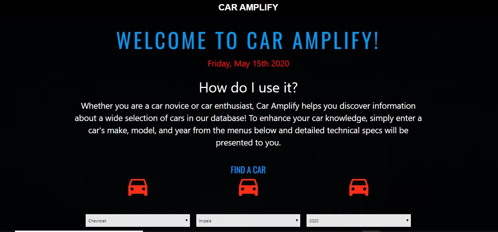
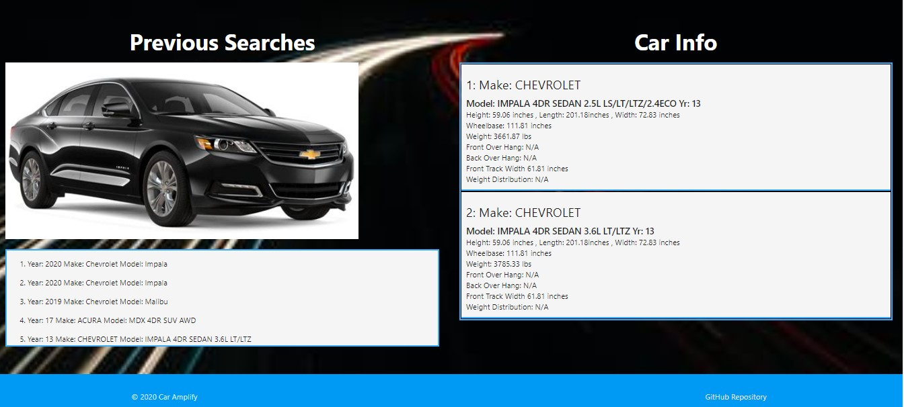

# Car Amplify 
Car Amplify is a fully responsive app for car lovers looking to find out detailed technical specs about their car of choice. our website allows you to search by car make and model and will pull back all the items that meet the user selected criteria. You are presented with information about the height, length, and width of the selected car(s)as well as other technical information such as weight, weight distribution and overhang. The technologies we used in this project are HTML, CSS, Javascript, jQuery, Materialize framework, Myslq, Node.js, Moment.js, the MVC file structure and a host of node packages. These packages include express, express- handlebars, mysql, dotenv, path, and sequelize. This was a group project consisting of 4 members, completed remotely over the course of a week. 
Link: https://car-amplify.herokuapp.com/

